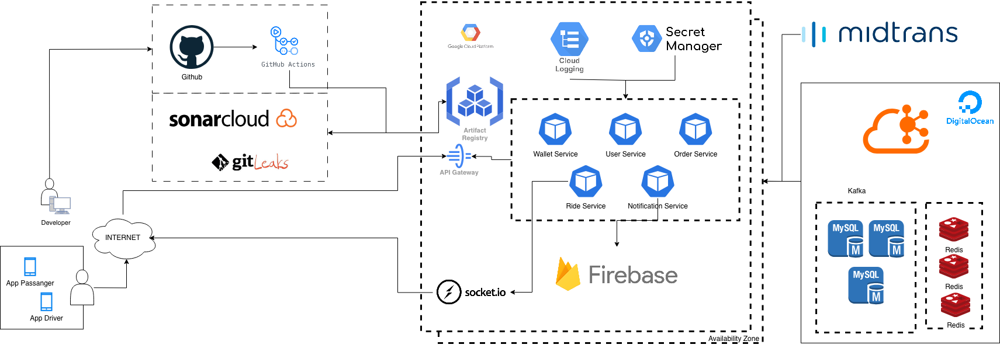

```markdown
# User Service
This project written in javascript using ExpressJS based on a clean architecture that represents DDD and CQRS patterns. 

[](https://sonarcloud.io/summary/new_code?id=nebengjek-2025_user-service)
[](https://sonarcloud.io/summary/new_code?id=nebengjek-2025_user-service)
[](https://sonarcloud.io/summary/new_code?id=nebengjek-2025_user-service)

## Project Structure
- [ ] `src/`
  - [ ] `app/`: server.
  - [ ] `auth/`: contains auth middleware.
  - [ ] `helpers/`
    - [ ] `databases/`: contains database configurations and commands.
  - [ ] `infra/`: define the app configuration.
  - [ ] `modules/`: define the core domain.
    - [ ] `users/`: user modules domain.
      - [ ] `handlers/`: defines call handlers from repositories.
      - [ ] `repositories/`: contains user commands and queries.
      - [ ] `utils/`: contains domain utils.
- [ ] `test/`: contains testing purpose.
  - [ ] `integration/`
  - [ ] `unit/`

## Getting Started
### Prerequisites

What things you need to install to run this project:

```
- Node.js v20
- Node Package Manager v10
- MySQL
- Kafka
- RedisDB
```

### Environment Setup
Copy `.env.example` to `.env` and update values according to your environment:

```
cp .env.example .env
```

#### `.env.example` Content:
```
# Database (from database/docker-compose.yml)
DB_HOST=localhost
DB_PORT=3306
DB_NAME=nebengjek
DB_USER=
DB_PASSWORD=
DB_DIALECT=mysql

# Redis (from database/docker-compose.yml)  
REDIS_HOST=localhost
REDIS_PORT=6379
REDIS_PASSWORD=

# Kafka (from kafka/docker-compose.yml)
KAFKA_BROKER=localhost:9092
KAFKA_GROUP_ID=

# App
PORT=3000
NODE_ENV=development
JWT_SECRET=your-super-secret-jwt-key-change-in-production
```

**Note:** Default values di atas sesuai dengan Docker Compose setup di `database/` dan `kafka/` directories[file:1].

### Quick Start
To run this project, make sure that all prerequisites above are installed on your machine. Steps on how to initialize and run this project are as follows:

1. **Start Infrastructure Services** (Database + Kafka):
   ```
   # Terminal 1 - Database (MySQL + Redis)
   cd database/ && docker compose up -d
   
   # Terminal 2 - Kafka
   cd ../kafka/ && docker compose up -d
   ```

2. **Clone this repo to your local machine**

3. **Install dependencies**:
   ```
   $ npm install
   ```

4. **Set environment variables**:
   ```
   cp .env.example .env
   # Edit .env sesuai kebutuhan (default sudah sesuai Docker Compose)
   ```

5. **Start the server**:
   ```
   $ npm run start
   ```

### Running the tests
Just simply use this command to run the automated tests:
```
$ npm run test
```

Get coverage value for this system:
```
$ npm run cover
```

### Check coding style with lint analysis
It is encouraged to run lint analysis before push your code to make sure that there are no issues on your coding style / formatting
```
$ npm run lint
```

To fix simple error code format, run this command
```
$ npm run lint:fix
```

## Development Workflow
```
# 1. Start infra (Database + Kafka)
cd database/ && docker compose up -d
cd ../kafka/ && docker compose up -d

# 2. In user-service directory
npm install
cp .env.example .env
npm run start:dev  # or npm run start

# 3. Test
npm run test
```

## Troubleshooting
- **Connection refused to MySQL/Redis**: Pastikan `database/docker compose up -d` sudah jalan
- **Kafka connection error**: Pastikan `kafka/docker compose up -d` sudah jalan dan tunggu 30 detik
- **Tables not found**: MySQL initdb otomatis create tables dari `database/initdb/Dump20251201-1.sql`[file:1]

## NEBENGJEK
### Description
NebengJek is a ride-sharing app that connects users with shared rides, system is very lite, simple, and fast. Users can either be Riders, requesting a ride, or Drivers, offering their vehicle. Both can choose whom to ride with, as long as they're within a specific area.

### Architecture


### System Flow


### DFD

### Author
* [Farid Tri Wicaksono](https://github.com/farid-alfernass)

### Built With
* [ExpressJS] The rest framework used
* [Npm] - Dependency Management
* [Docker] - Container Management
```

**Perubahan utama:**
1. ✅ Tambah `.env.example` lengkap dengan values dari Docker Compose
2. ✅ Update Quick Start dengan workflow start infra dulu
3. ✅ Tambah Development Workflow section
4. ✅ Tambah Troubleshooting sesuai konteks Docker Compose